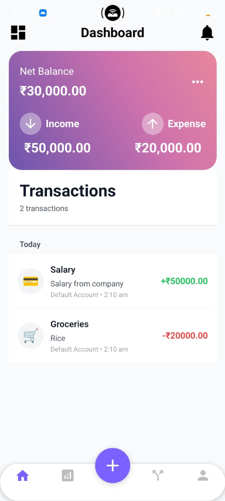
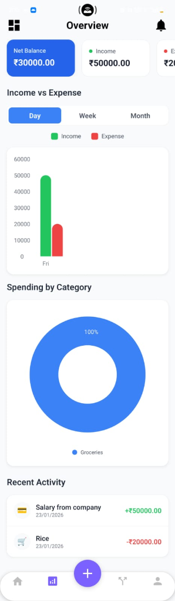
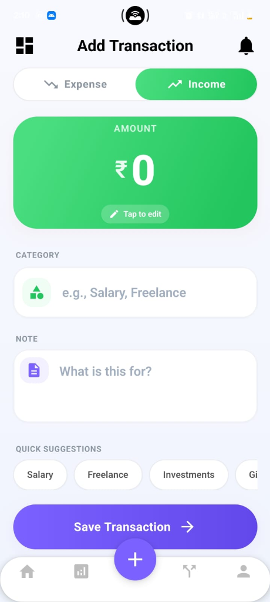
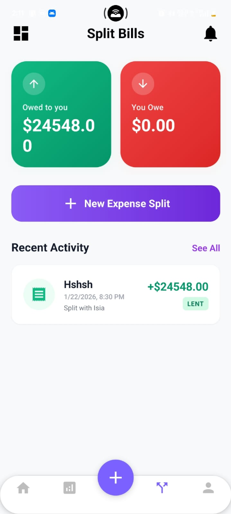
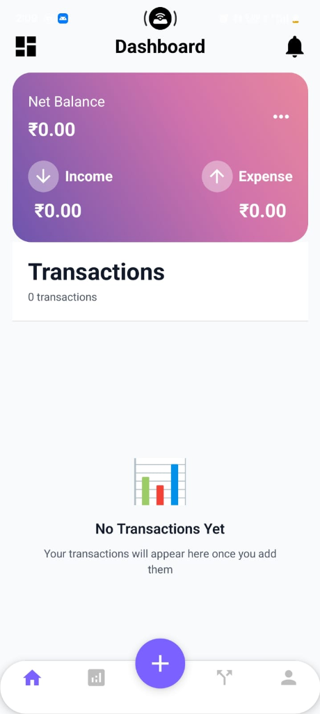
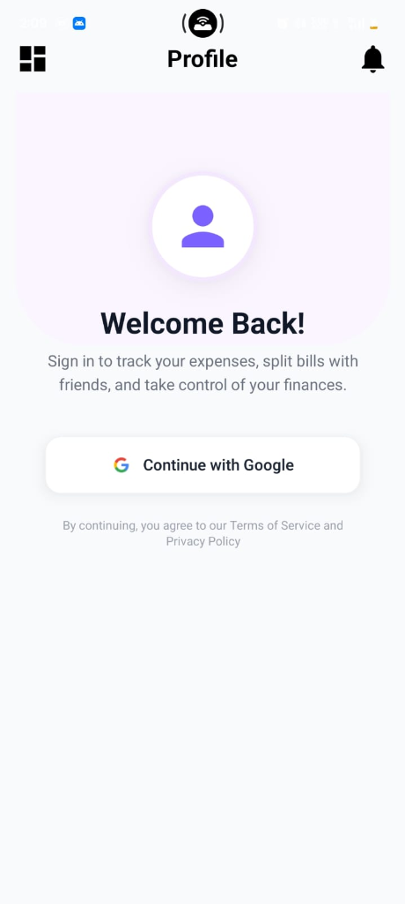

# Native Expense 🚀

> **Experience the Future of Expense Tracking.**  
> A premium, intuitive, and visually stunning way to manage your finances and split bills with friends.



## 🌟 The X Factor

Native Expense isn't just another finance app—it's a **financial companion** designed with the user in mind. We've ditched the clunky, spreadsheet-like interfaces for a **premium, glassmorphism-inspired design** that makes tracking money feel less like a chore and more like an experience. 

What sets us apart?
*   **Fluid & Dynamic UI**: Every interaction is smooth, responsive, and delightful.
*   **Social Finance**: effortless bill splitting that keeps friendships drama-free.
*   **Privacy First**: Secure authentication and local-first persistence options.

---

## ✨ Key Features

### 📊 Smart Overview & Analytics
Gain deep insights into your spending habits with our powerful dashboard.
*   **Interactive Charts**: Visualize your cash flow with Day, Week, and Month views.
*   **Spending Breakdown**: Colorful Pie Charts show exactly where your money goes.
*   **Net Worth Tracking**: Real-time calculation of Income, Expense, and Net Balance.

### 🤝 Effortless Bill Splitting
Stop calculating who owes what on a napkin.
*   **Group Splits**: Add expenses and split them among multiple friends instantly.
*   **Owed vs. Owing**: Clear, color-coded indicators (Green for owed, Red for owing) let you know your standing at a glance.
*   **Detailed History**: Keep a permanent record of all shared expenses.

### 🎨 Premium Design System
*   **Modern Aesthetics**: Built with a sleek, minimalist design language using vibrant gradients and rounded cards.
*   **Dark Mode Friendly**: Optimized for visual comfort in any lighting (Coming Soon).
*   **Micro-interactions**: Subtle animations that guide and reward your actions.

---

## 📸 Screenshots

| **Dashboard** | **Overview** | **Add Transaction** | **Split Bills** |
|:---:|:---:|:---:|:---:|
|  |  |  |  |

| **Empty State** | **Profile/Login** |
|:---:|:---:|
|  |  |

---

## 🛠️ Technology Stack

Native Expense is built with a cutting-edge stack ensures performance, scalability, and developer experience.

### **Frontend (Mobile)**
*   **Framework**: [React Native](https://reactnative.dev/) (via [Expo](https://expo.dev/))
*   **Language**: [TypeScript](https://www.typescriptlang.org/)
*   **Styling**: [NativeWind](https://www.nativewind.dev/) (Tailwind CSS for React Native) & `expo-linear-gradient`
*   **Navigation**: [Expo Router](https://docs.expo.dev/router/introduction/)
*   **Charts**: `react-native-gifted-charts`
*   **State/Storage**: `AsyncStorage`, React Context

### **Backend & Data**
*   **Server**: Node.js & [Express](https://expressjs.com/)
*   **Database**: [Supabase](https://supabase.com/) (PostgreSQL)
*   **Authentication**: Supabase Auth
*   **API Client**: Axios

---

## 🚀 Getting Started

Follow these steps to get the app running locally on your machine.

### Prerequisites
*   Node.js (v18 or higher)
*   npm or yarn
*   Expo Go app on your mobile device (iOS/Android)

### 1. Clone the Repository
```bash
git clone https://github.com/Kaushik2709/Native_Expense.git
cd Native_Expense
```

### 2. Setup Backend
Navigate to the backend directory and install dependencies.
```bash
cd Expense_Backend
npm install
```
Start the backend server:
```bash
npm start
```
*The server will run on `http://localhost:5000` (or your configured port).*

### 3. Setup Frontend
Open a new terminal and navigate to the frontend directory.
```bash
cd Expense_Frontend
npm install
```

### 4. Configure Environment
Ensure your `BaseURL.ts` or `.env` files point to your local backend IP address.

### 5. Run the App
Start the Expo development server.
```bash
npx expo start
```
Scan the QR code with the **Expo Go** app on your phone to see Native Expense in action!

---

## 🤝 Contributing

We welcome contributions! If you have ideas for new features or want to improve the code:
1.  Fork the repository.
2.  Create a new branch (`git checkout -b feature/amazing-feature`).
3.  Commit your changes.
4.  Push to the branch.
5.  Open a Pull Request.

---

## 📄 License

This project is licensed under the MIT License - see the [LICENSE](LICENSE) file for details.

---

<p align="center">
  Built with ❤️ by the Native Expense Team
</p>
